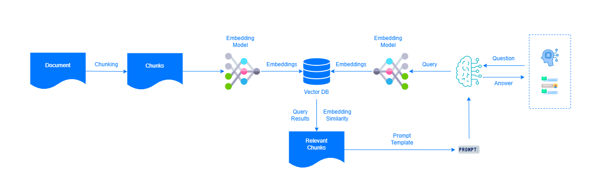

# vecx

[](https://github.com/ai-flowx/vecx/actions?query=workflow%3Aci)
[](https://github.com/ai-flowx/vecx/blob/main/LICENSE)
[](https://github.com/ai-flowx/vecx/tags)


## Introduction

*vecx* is the ai vector store of [flowx](https://github.com/ai-flowx/) written in Rust.


## Prerequisites

- Rust >= 1.83.0


## Run

```bash
```


## Usage

```
```


## Settings

*vecx* parameters can be set in the directory [config](https://github.com/ai-flowx/vecx/blob/main/src/config).

An example of configuration in [config.yml](https://github.com/ai-flowx/vecx/blob/main/src/config/config.yml):

```yaml
```


## Architecture


## Diagram




## Features

- **Compatibility**
  - vikingdb


- **Data**
  - multimodal data


- **Deployment**
  - cloud-side
  - device-side


- **Indexing**
  - automatic indexing
  - millisecond-level retrieval
  - real-time data writing
  - real-time indexing
  - second-level index update  


- **Model**
    - inline vector model


- **Storage**
    - graph storage


## License

Project License can be found [here](LICENSE).


## Reference

### Cache

- [sccache](https://github.com/mozilla/sccache)

### Embedding

- [jina-models](https://jina.ai/models)
- [voyageai-models](https://docs.anthropic.com/zh-CN/docs/build-with-claude/embeddings)
- [voyageai-models](https://www.voyageai.com/)

### LangChain

- [api](https://github.com/langchain-ai/langchain/blob/master/libs/core/langchain_core/vectorstores/base.py)
- [vikingdb](https://github.com/langchain-ai/langchain/blob/master/libs/community/langchain_community/vectorstores/vikingdb.py)

### Memory

- [long-term-memory](https://langchain-ai.github.io/long-term-memory/)
- [mem0](https://github.com/mem0ai/mem0)
- [memgraph](https://github.com/memgraph/memgraph)
- [zep](https://www.getzep.com/)
- [zero-copy](https://github.com/tokio-rs/bytes)

### RAG

- [aliyun-graphrag](https://developer.aliyun.com/article/1540097)
- [ragflow](https://github.com/infiniflow/ragflow)
- [tree-sitter-graph](https://github.com/tree-sitter/tree-sitter-graph)

### Toolchains

- [rustup-android](https://github.com/rust-lang/rustup/issues/2872)

### Vector

- [benchmark](https://github.com/zilliztech/VectorDBBench)
- [polardb-for-postgresql](https://gitee.com/polardb/PolarDB-for-PostgreSQL)
- [qdrant](https://github.com/qdrant/qdrant)
- [similarity-search](https://github.com/facebookresearch/faiss)
- [vikingdb](https://www.volcengine.com/docs/82379/1263276)
