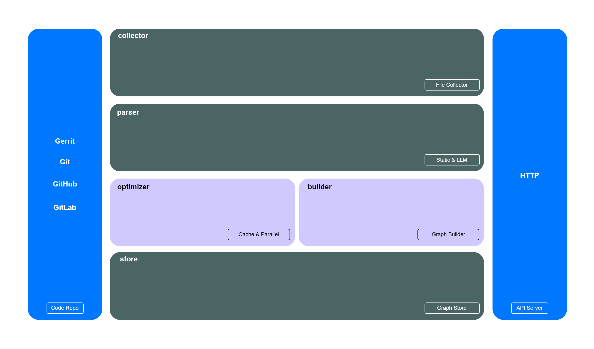

# ragx

[](https://github.com/ai-flowx/ragx/actions?query=workflow%3Aci)
[](https://github.com/ai-flowx/ragx/blob/main/LICENSE)
[](https://github.com/ai-flowx/ragx/tags)


## Introduction

*ragx* is the ai rag of [flowx](https://github.com/ai-flowx/) written in Rust.


## Prerequisites

- Rust >= 1.83.0


## Run

```bash
./ragx --config-file="config.yml" --listen-port=":8080" --repo-path="git:path/to/repo"
```


## Usage

```
Usage: ragx --config-file <FILE> --listen-port <PORT> --repo-path <PATH>

Options:
  -c, --config-file <FILE>  Config file [default: config.yml]
  -l, --listen-port <PORT>  Listen port [default: :8080]
  -r, --repo-path <PATH>    Repo path (upstream:path/to/repo, upstream:gerrit|git|github|gitlab) [default: git:.]
  -h, --help                Print help
  -V, --version             Print version
```


## Settings

*ragx* parameters can be set in the directory [config](https://github.com/ai-flowx/ragx/blob/main/src/config).

An example of configuration in [config.yml](https://github.com/ai-flowx/ragx/blob/main/src/config/config.yml):

```yaml
```


## Architecture



- `collector`: [walkdir](https://docs.rs/walkdir/latest/walkdir/)
- `parser`: [tree-sitter](https://docs.rs/tree-sitter/latest/tree_sitter/) (static), [tokenizers](https://docs.rs/tokenizers/latest/tokenizers/) & [rust-bert](https://docs.rs/rust-bert/latest/rust_bert/) (llm)
- `optimizer`: [moka](https://docs.rs/moka/latest/moka/) (cache), [tokio](https://docs.rs/tokio/latest/tokio/) (parallel)
- `builder`: [tree-sitter-graph](https://docs.rs/tree-sitter-graph/latest/tree_sitter_graph/)
- `memory`: [petgraph](https://docs.rs/petgraph/latest/petgraph/)
- `api`: [axum](https://docs.rs/axum/latest/axum/)


## Indexing

### Node

- `id`: node id
- `name`: node name
- `type`: node type (class, file, function, variable)
- `filePath`: file path
- `language`: programming language
- `fullName`: full name
- `lineNumber`: line number
- `description`: description generated by llm


### Edge

- `contain`: hierarchical relationships
- `extend`: inheritance or interface implementation
- `depend`: file/function/module/type dependency
- `call`: function calling


## License

Project License can be found [here](LICENSE).


## Reference

### Framework

- [letta](https://github.com/letta-ai/letta)
- [sandboxfusion](https://github.com/bytedance/SandboxFusion)

## LangChain

- [api](https://github.com/langchain-ai/langchain/blob/master/libs/core/langchain_core/vectorstores/base.py)
- [vikingdb](https://github.com/langchain-ai/langchain/blob/master/libs/community/langchain_community/vectorstores/vikingdb.py)

### Memory

- [long-term-memory](https://langchain-ai.github.io/long-term-memory/)
- [mem0](https://github.com/mem0ai/mem0)
- [memgraph](https://github.com/memgraph/memgraph)
- [zep](https://www.getzep.com/)

### RAG

- [codegraphrag](https://mp.weixin.qq.com/s/hYJsWDkh6GnM1xqpg4gnXw)
- [tree-sitter-graph](https://github.com/tree-sitter/tree-sitter-graph)
- [vanna](https://github.com/vanna-ai/vanna)

### Vector

- [benchmark](https://github.com/zilliztech/VectorDBBench)
- [qdrant](https://github.com/qdrant/qdrant)
- [similarity-search](https://github.com/facebookresearch/faiss
- [vikingdb](https://www.volcengine.com/docs/82379/1263276)
