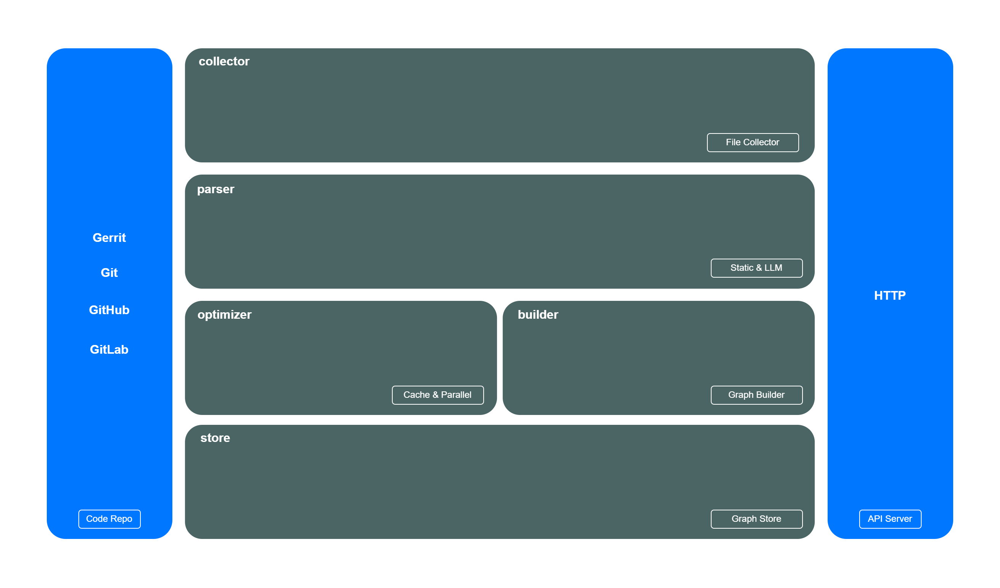

# ragx

[](https://github.com/ai-flowx/ragx/actions?query=workflow%3Aci)
[](https://github.com/ai-flowx/ragx/blob/main/LICENSE)
[](https://github.com/ai-flowx/ragx/tags)


## Introduction

*ragx* is the AI RAG of *[flowx](https://github.com/ai-flowx/)* written in Rust.


## Prerequisites

- Rust >= 1.83.0


## Run

```bash
./ragx --config-file="config.yml" --listen-url=":8080"
```


## Usage

```
Usage: ragx --config-file <NAME> --listen-url <URL>

Options:
  -c, --config-file <NAME>  Config file [default: config.yml]
  -l, --listen-url <URL>    Listen url [default: :8080]
  -h, --help                Print help
  -V, --version             Print version
```


## Settings

*ragx* parameters can be set in the directory [config](https://github.com/ai-flowx/ragx/blob/main/src/config).

An example of configuration in [config.yml](https://github.com/ai-flowx/ragx/blob/main/src/config/config.yml):

```yaml
TBD
```


## Architecture




## Indexing

### Node

- `id`: node id
- `name`: node name
- `type`: node type (class, file, function, variable)
- `filePath`: file path
- `language`: programming language
- `fullName`: full name
- `lineNumber`: line number
- `description`: description generated by llm


### Edge

- `contain`: hierarchical relationships
- `extend`: inheritance or interface implementation
- `depend`: file/function/module/type dependency
- `call`: function calling


## License

Project License can be found [here](LICENSE).


## Reference

- [codegraphrag](https://mp.weixin.qq.com/s/hYJsWDkh6GnM1xqpg4gnXw)
- [letta](https://github.com/letta-ai/letta)
- [long-term-memory](https://langchain-ai.github.io/long-term-memory/)
- [mem0](https://github.com/mem0ai/mem0)
- [memgraph](https://github.com/memgraph/memgraph)
- [sandboxfusion](https://github.com/bytedance/SandboxFusion)
- [vanna](https://github.com/vanna-ai/vanna)
- [zep](https://www.getzep.com/)
